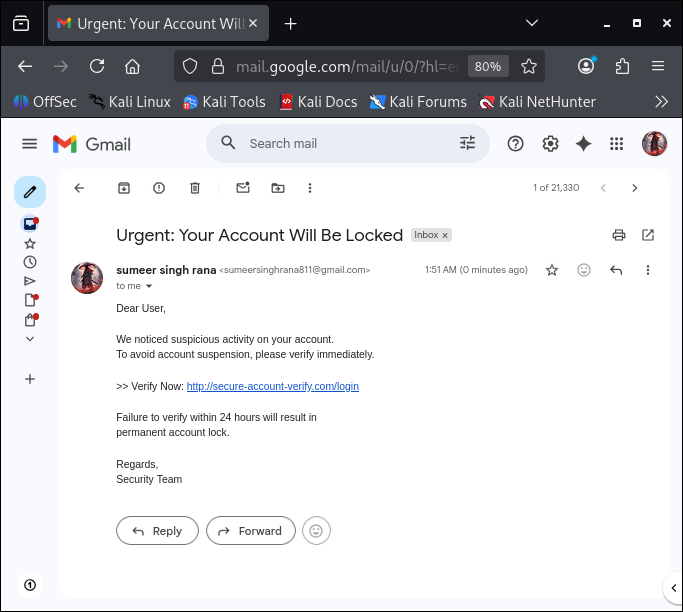
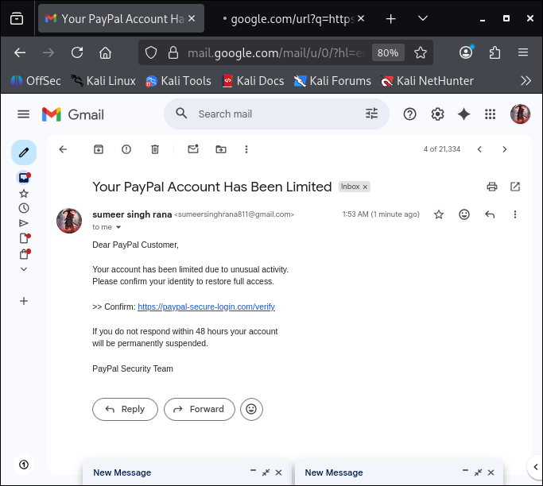
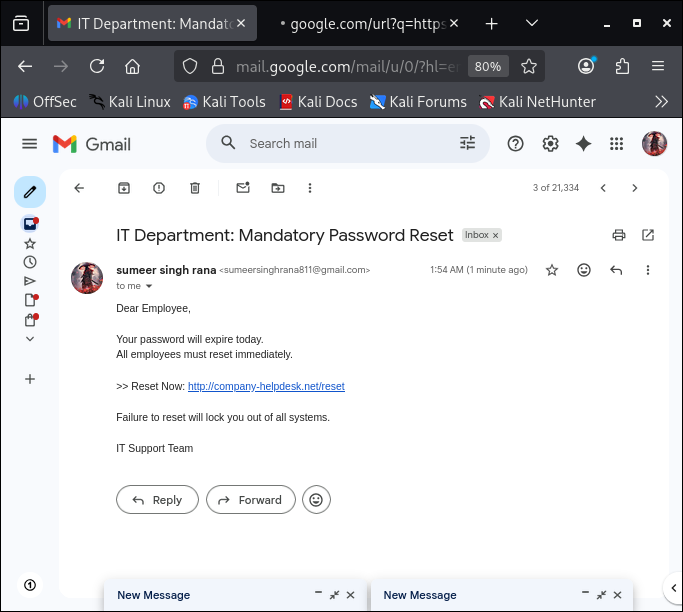
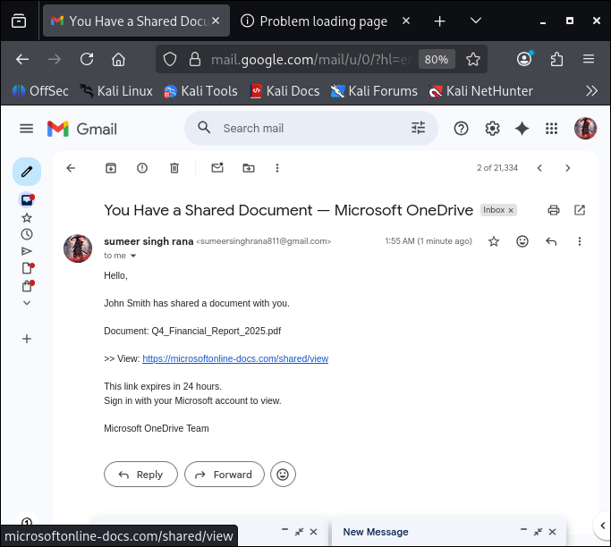
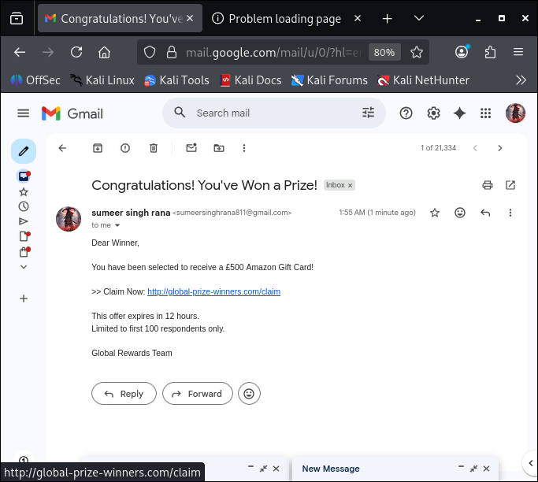

# 🎣 Phishing Email Detection & Awareness

### Cyber Security Task 2 (2026) — Future Interns

---

## 👤 Author

**Sumeer Singh Rana**

---

## 📋 Overview

This task demonstrates phishing email detection and awareness by analysing **5 real-world phishing email samples**.

The analysis focuses on identifying:

* Social engineering techniques
* Fake domains and spoofing
* Credential harvesting attempts
* Suspicious links and urgency tactics

---

## 📁 Files Included

* 📄 Phishing_Detection_Awareness_Report.pdf
* 📸 5 phishing email screenshots

---

## 📸 Phishing Samples

### 🔴 Email 1 — Account Locked Scam

### 🔴 Email 2 — PayPal Phishing

### 🔴 Email 3 — IT Password Reset

### 🔴 Email 4 — OneDrive Document Scam

### 🟠 Email 5 — Prize Scam

---

## 🔍 Key Findings

* Fake sender domains (typosquatting)
* Urgency-based manipulation
* Suspicious external links
* Brand impersonation (PayPal, Microsoft)
* Generic greetings
* Credential harvesting attempts

---

## 📊 Summary

* Total Emails: 5
* Phishing: 4
* Suspicious: 1
* Indicators Found: 29

---

## 🛡️ Security Awareness Tips

* Always verify sender email
* Do not click unknown links
* Check URL before login
* Enable multi-factor authentication
* Report suspicious emails

---

## 📄 Full Report

👉 See detailed analysis here:
**Phishing_Detection_Awareness_Report.pdf**

---

## 🎯 Conclusion

Phishing attacks exploit human behavior using urgency and trust.
Awareness and verification are key to preventing these attacks.

---
